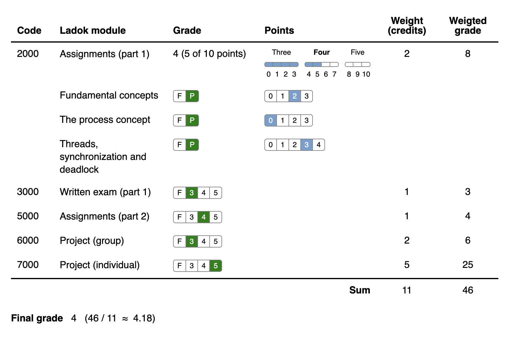

<br/>


GradeCulator is a final grade calculator for courses where the final grade

is calculated as a weighed average of a set of the grades for the Ladok modules
of the course. The calculator can for example be added to a page in
Studium/Canvas to makes it easy for students to understand how each of the Ladok
module grades affects the final grade. The calculator also makes it easy to see
how an indivdual assignment grade affects the final grade. 

# Example

In the below example from the OSPP (1DT096) course, the final grade is
calculated as a weighted average of all the Ladok modules with grade scale Fail,
3, 4, 5 with the number of credits for each module as weight. 

<p align="center">

</p>

The Assignments (part 1) module consists of three graded assignmetns and the grade
for this module is the average of the grades for these three assignments. In
this example (3 + 3 + 3)/3 ≈ 3.00 = 3.

Each of the reminding moudles only has a single graded artifact. 

The final grade is calculated as follows: 
(2\*3 + 1\*3 + 1\*3 + 2\*3 + 5\*3) / (2 + 1 + 1 + 5 + 2) =
33/11 ≈ 3.00 ≈ 3.

If one or more of the graded artifacts has the grade **Fail**, no final grade can be
calculated shown in the below example. 

<p align="center"r>

</p>

# Demo

Check out this [demo][demo] of the GradeCulator confiugred for the OSPP (1DT096) course.  

[demo]: https://htmlpreview.github.io/?https://github.com/kamar535/gradeculator/blob/master/demo/gradeculator.html
# Implemented in Elm

The final grade calculator is implemented in [Elm][elm], a
small [statically typed][types] functional language with [algebraic data
types][custom-data-types] and [pattern-matching][pattern-matching].
Elm [compiles][elm-make] to JavaScript.

[elm]: https://elm-lang.org/
[types]: https://guide.elm-lang.org/types/
[custom-data-types]: https://guide.elm-lang.org/types/custom_types.html
[pattern-matching]: https://guide.elm-lang.org/types/pattern_matching.html
[elm-make]: https://guide.elm-lang.org/install/elm.html#elm-make

# Create Elm App

This project is bootstrapped with [Create Elm
App](https://github.com/halfzebra/create-elm-app). Read more in the [CreateElmApp.md](CreateElmApp.md).

## Development mode

To run the app in the development mode, execute the following command in the
terminal from the project root directory. 

```
elm-app start
```

Now a new tab in your web browser should open with your Elm application.  


## Unsupported digital envelop routines

If you get the following error when trying `elm-app start`:

```
Starting the development server...

Error: error:0308010C:digital envelope routines::unsupported
    at new Hash (node:internal/crypto/hash:68:19)
    at Object.createHash (node:crypto:138:10)
    at module.exports (/usr/local/lib/node_modules/create-elm-app/node_modules/webpack/lib/util/createHash.js:135:53)
    at NormalModule._initBuildHash (/usr/local/lib/node_modules/create-elm-app/node_modules/webpack/lib/NormalModule.js:417:16)
    at handleParseError (/usr/local/lib/node_modules/create-elm-app/node_modules/webpack/lib/NormalModule.js:471:10)
    at /usr/local/lib/node_modules/create-elm-app/node_modules/webpack/lib/NormalModule.js:503:5
    at /usr/local/lib/node_modules/create-elm-app/node_modules/webpack/lib/NormalModule.js:358:12
    at /usr/local/lib/node_modules/create-elm-app/node_modules/loader-runner/lib/LoaderRunner.js:373:3
    at iterateNormalLoaders (/usr/local/lib/node_modules/create-elm-app/node_modules/loader-runner/lib/LoaderRunner.js:214:10)
    at iterateNormalLoaders (/usr/local/lib/node_modules/create-elm-app/node_modules/loader-runner/lib/LoaderRunner.js:221:10)
/usr/local/lib/node_modules/create-elm-app/scripts/start.js:11
  throw err;
  ^

Error: error:0308010C:digital envelope routines::unsupported
    at new Hash (node:internal/crypto/hash:68:19)
    at Object.createHash (node:crypto:138:10)
    at module.exports (/usr/local/lib/node_modules/create-elm-app/node_modules/webpack/lib/util/createHash.js:135:53)
    at NormalModule._initBuildHash (/usr/local/lib/node_modules/create-elm-app/node_modules/webpack/lib/NormalModule.js:417:16)
    at /usr/local/lib/node_modules/create-elm-app/node_modules/webpack/lib/NormalModule.js:452:10
    at /usr/local/lib/node_modules/create-elm-app/node_modules/webpack/lib/NormalModule.js:323:13
    at /usr/local/lib/node_modules/create-elm-app/node_modules/loader-runner/lib/LoaderRunner.js:367:11
    at /usr/local/lib/node_modules/create-elm-app/node_modules/loader-runner/lib/LoaderRunner.js:233:18
    at context.callback (/usr/local/lib/node_modules/create-elm-app/node_modules/loader-runner/lib/LoaderRunner.js:111:13)
    at /usr/local/lib/node_modules/create-elm-app/node_modules/babel-loader/lib/index.js:59:103 {
  opensslErrorStack: [ 'error:03000086:digital envelope routines::initialization error' ],
  library: 'digital envelope routines',
  reason: 'unsupported',
  code: 'ERR_OSSL_EVP_UNSUPPORTED'
}

Node.js v21.4.0
```

, try this [workaround]:

[workaround]: https://github.com/NixOS/nixpkgs/issues/209668
```
NODE_OPTIONS="--openssl-legacy-provider" elm-app start
```

# Embed in Studium

Follow these steps to embed the GradeCulator to a course in Studium. 

## Compile to Javascript

```
elm make src/Main.elm --output=studium/gradeculator.js
```


## Upload to Studium

Upload `studium/gradeculator.html` and `studium/gradeculator.js` to the files area in Studium.

## Embed the GradeCulator on a Studium/Canas page

This solution is based on https://canvas.ou.edu/courses/56095


In the files area, click on `gradeculator.html` to preview the file. In the
address bar you will see something similar to this:

``` shell
https://uppsala.instructure.com/courses/55113/files/folder/GradeCulator?preview=2836960
                                        -----                                   -------
                                          ^                                        ^
                                          |                                        |               
                                          |                                        |
                                         
                                      Course ID                                 File ID
```

Use the `Course ID` and `File ID` to create an `<iframe>`.
```
<iframe src="https://uppsala.instructure.com/courses/<Course ID>/files/<File
ID>/download" width="450" height="320"
data-api-endpoint="https://uppsala.instructure.com/api/v1/courses/<Course
ID>/files/<File ID>" data-api-returntype="File"></iframe>
```

, for example:

``` shell
<iframe src="https://uppsala.instructure.com/courses/55113/files/2836960/download" width="450" height="320" data-api-endpoint="https://uppsala.instructure.com/api/v1/courses/55113/files/2836960" data-api-returntype="File"></iframe>
```
